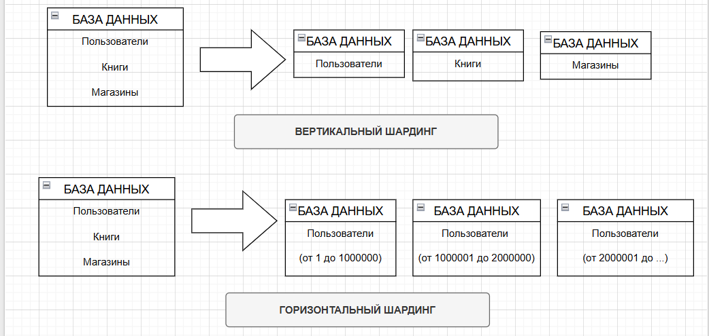

# Домашнее задание к занятию "Репликация и масштабирование. Часть 2" - Tarkov Viktor

### Инструкция по выполнению домашнего задания

   1. Сделайте `fork` данного репозитория к себе в Github и переименуйте его по названию или номеру занятия, например, https://github.com/имя-вашего-репозитория/git-hw или  https://github.com/имя-вашего-репозитория/7-1-ansible-hw).
   2. Выполните клонирование данного репозитория к себе на ПК с помощью команды `git clone`.
   3. Выполните домашнее задание и заполните у себя локально этот файл README.md:
      - впишите вверху название занятия и вашу фамилию и имя
      - в каждом задании добавьте решение в требуемом виде (текст/код/скриншоты/ссылка)
      - для корректного добавления скриншотов воспользуйтесь [инструкцией "Как вставить скриншот в шаблон с решением](https://github.com/netology-code/sys-pattern-homework/blob/main/screen-instruction.md)
      - при оформлении используйте возможности языка разметки md (коротко об этом можно посмотреть в [инструкции  по MarkDown](https://github.com/netology-code/sys-pattern-homework/blob/main/md-instruction.md))
   4. После завершения работы над домашним заданием сделайте коммит (`git commit -m "comment"`) и отправьте его на Github (`git push origin`);
   5. Для проверки домашнего задания преподавателем в личном кабинете прикрепите и отправьте ссылку на решение в виде md-файла в вашем Github.
   6. Любые вопросы по выполнению заданий спрашивайте в чате учебной группы и/или в разделе “Вопросы по заданию” в личном кабинете.
   
Желаем успехов в выполнении домашнего задания!
   
### Дополнительные материалы, которые могут быть полезны для выполнения задания

1. [Руководство по оформлению Markdown файлов](https://gist.github.com/Jekins/2bf2d0638163f1294637#Code)

---

### Задание 1

Опишите основные преимущества использования масштабирования методами:

   - активный master-сервер и пассивный репликационный slave-сервер;
   - master-сервер и несколько slave-серверов;

*Дайте ответ в свободной форме.*

Активный master-сервер и пассивный репликационный slave-сервер:

   - Высокая доступность: slave-сервер может служить резервной копией master-сервера, и при отказе master его можно переключить на slave, что обеспечивает непрерывность работы системы.
   - Улучшенная производительность чтения: операции чтения можно выполнять на slave, разгружая master, который выполняет операции записи.
   - Надежность и резервное копирование: slave-серверы содержат копии данных master, что помогает в восстановлении в случае сбоев или потери данных.
   - Консистентность данных: изменения, внесённые на master, реплицируются на slave, поддерживая синхронизацию данных.

Master-сервер и несколько slave-серверов:

   - Масштабируемость чтения: распределение операций чтения между несколькими slave-серверами значительно снижает нагрузку на master и улучшает производительность всей системы.
   - Гибкость в использовании ресурсов: отдельные slave-серверы можно задействовать для ресурсоемких задач, таких как аналитика или отчётность, не влияя на производительность основной базы данных.
   - Повышенная отказоустойчивость: наличие нескольких реплик увеличивает надёжность и доступность данных.
   - Возможность распределения нагрузки и оптимизация работы под разные типы запросов (например, чтение с slave, запись на master).

Главное ограничение обоих методов — задержка репликации, из-за чего данные на slave могут отставать от master, а при отказе master необходимо реализовать механизм выбора нового master для поддержания работоспособности.

Таким образом, схема с одним активным master и пассивным slave обеспечивает базовую резервируемость и разгрузку, а схема с одним master и несколькими slave-серверами — улучшенную масштабируемость чтения и повышенную отказоустойчивость за счет распределения нагрузки и наличия множества копий данных.

---

### Задание 2

Разработайте план для выполнения горизонтального и вертикального шаринга базы данных. База данных состоит из трёх таблиц:

   - пользователи,
   - книги,
   - магазины (столбцы произвольно).

Опишите принципы построения системы и их разграничение или разбивку между базами данных.

*Пришлите блоксхему, где и что будет располагаться. Опишите, в каких режимах будут работать сервера.*

**Вертикальный шардинг (разбиение по столбцам):**

Принцип: таблицы делятся по набору столбцов, при этом данные одной таблицы разбиваются и хранятся на нескольких серверах.

Например, в таблице *пользователей* можно разделить личные данные (имя, адрес электронной почты, дата рождения) и параметры авторизации (пароли, токены) и хранить их на разных шард-серверах.
В таблице *книги* можно выделить данные книги (название, автор, год издания) на одном шарде, а описание, обложку и отзывы — на другом.
В таблице *магазинов* основную информацию о магазине (название, адрес) следует выделить отдельно от служебных данных (статистика, рейтинги).

**Горизонтальный шардинг (разбиение по строкам):**

Принцип: каждая таблица сохраняет свою структуру, но данные в ней распределяются по строкам между несколькими серверами или базами данных.

Таблица *пользователей*: шардирование по пользователь_id или географическому признаку (например, пользователи из разных регионов в разных шардах).
Таблица *книг*: шардирование по диапазону книга_id или категории книг.
Таблица *магазинов*: шардирование по магазин_id или региональному признаку.

---

